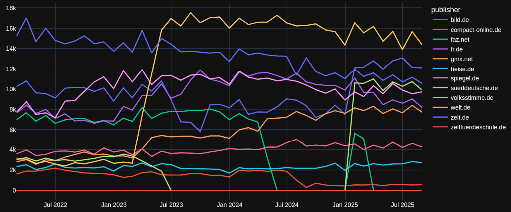

# Archive of news front pages

Collects article headlines and stores them in [json files](docs/snapshots).

## Scraped sites:

| id                                                          | since      | pages | url                              |
|:------------------------------------------------------------|:-----------|------:|:---------------------------------|
| [bild.de](docs/snapshots/bild.de)                           | 2022-01-28 |    26 | https://www.bild.de              |
| [compact-online.de](docs/snapshots/compact-online.de)       | 2022-01-29 |     5 | https://www.compact-online.de/   |
| [faz.net](docs/snapshots/faz.net)                           | 2022-01-29 |    14 | https://www.faz.net/             |
| [fr.de](docs/snapshots/fr.de)                               | 2022-01-28 |     8 | https://www.fr.de/               |
| [gmx.net](docs/snapshots/gmx.net)                           | 2022-01-29 |     7 | https://www.gmx.net/             |
| [heise.de](docs/snapshots/heise.de)                         | 2022-01-28 |    12 | https://www.heise.de/            |
| [spiegel.de](docs/snapshots/spiegel.de)                     | 2022-01-28 |    21 | https://www.spiegel.de/          |
| [spiegeldaily.de](docs/snapshots/spiegeldaily.de)           | 2022-01-28 |     5 | https://www.spiegeldaily.de/     |
| [sueddeutsche.de](docs/snapshots/sueddeutsche.de)           | 2022-01-29 |     7 | https://www.sueddeutsche.de/     |
| [t-online.de](docs/snapshots/t-online.de)                   | 2022-01-29 |     8 | https://www.t-online.de/         |
| [volksstimme.de](docs/snapshots/volksstimme.de)             | 2022-01-29 |     8 | https://www.volksstimme.de/      |
| [web.de](docs/snapshots/web.de)                             | 2022-01-29 |    15 | https://web.de                   |
| [welt.de](docs/snapshots/welt.de)                           | 2022-01-29 |    16 | https://www.welt.de              |
| [zeit.de](docs/snapshots/zeit.de)                           | 2022-01-29 |    16 | https://www.zeit.de/             |
| [zeitfuerdieschule.de](docs/snapshots/zeitfuerdieschule.de) | 2022-01-29 |     5 | https://www.zeitfuerdieschule.de |

Script tags are also collected, so we can trace back the use of trackers and such.

Full htmls of the individual pages are archived once per month in [frontpage-archive](https://github.com/defgsus/frontpage-archive).

This repo only collects article titles, urls, teaser texts, image urls and image texts.
I'm in the habit of creating one repo every year, which each is about 1 gig in size:

- https://github.com/defgsus/frontpage-archive-2 (from 2022)
- https://github.com/defgsus/frontpage-archive-2023
- https://github.com/defgsus/frontpage-archive-2024
- https://github.com/defgsus/frontpage-archive-2025
- https://github.com/defgsus/frontpage-archive-2026

However, i'm not so much in the habit of checking often, if the scrapers still work. 
Here is a plot of the number of new articles per month and publisher:

The sueddeutsche and faz scraper were broken for quite some time. And something magical seemed
to have happened at welt.de in the beginning of 2023. They either increased their
workload 5 times, put more AI slop on their page or somehow changed something in the html.
My scraper scripts were not changed in that year. 

All in all it's about 3.2 million article headlines right now (August 2025)

### TODO

- https://www.n-tv.de/
- https://www.handelsblatt.com/
- https://www.taz.de/
- https://www.wa.de/
- https://www.rnd.de/
- https://www.nzz.ch/
- https://www.bazonline.ch/
- https://www.focus.de/
- https://www.tagesschau.de/
- https://www.golem.de/
- https://www.kicker.de/
- https://www.achgut.com/
- https://www.stern.de/
